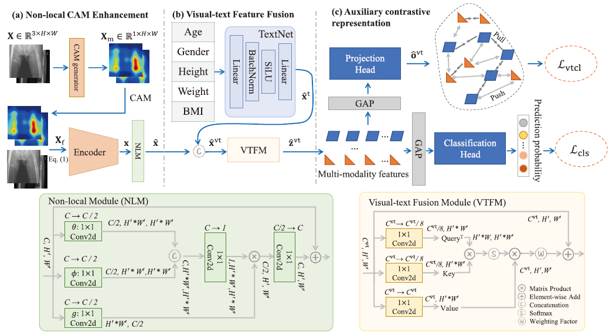
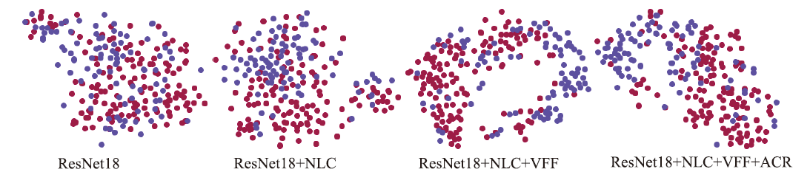
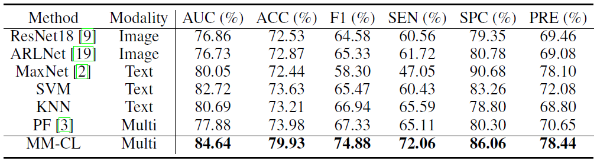

### MM-CL

**Multi-modality contrastive learning for sarcopenia screening from hip X-rays and clinical information** published in MICCAI 2023

by [Qiangguo Jin](https://scholar.google.com/citations?user=USoKG48AAAAJ), Changjiang Zou, Changming Sun, Hui Cui, Changming Sun, Shu-Wei Huang,
Yi-Jie Kuo, Ping Xuan, Leilei Cao, Ran Su, Leyi Wei, Henry B.L. Duh, and Yu-Pin Chen

### Example results 


- The framework of our proposed MM-CL. MM-CL is composed of (a) Non-local CAM Enhancement, (b) Visual-text Feature Fusion, and (c) Auxiliary contrastive representation..
  

- Visual interpretation of high-level features using t-SNE. The red and blue circles are sarcopenia and non-sarcopenia instances respectively.
  

- Sarcopenia diagnosis performance of recently proposed methods.

## Citation

If the code is helpful for your research, please consider citing:

  ```shell
    @inproceedings{JIN2023MMCL,
        title = "Multi-modality contrastive learning for sarcopenia screening from hip X-rays and clinical information",
        booktitle = "International Conference on Medical Image Computing and Computer-Assisted Intervention",
        year = "2023",
        organization = "Springer",
        author = "Qiangguo Jin, Changjiang Zou, Changming Sun, Hui Cui, Changming Sun, Shu-Wei Huang, Yi-Jie Kuo, Ping Xuan, Leilei Cao, Ran Su, Leyi Wei, Henry B.L. Duh, and Yu-Pin Chen",
    }
  ```


### Questions

General questions, please contact 'qgking@tju.edu.cn'


